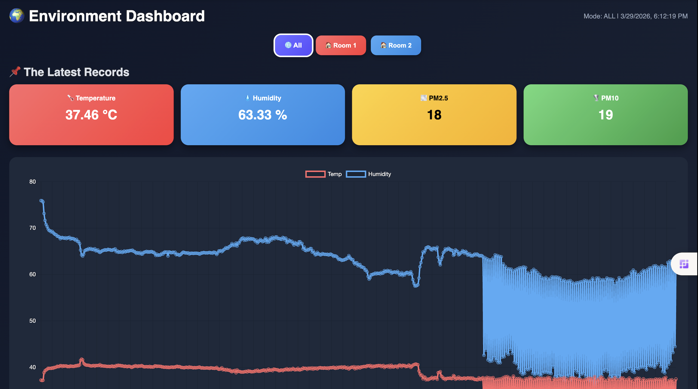

# ICT720-2026-Smart-Air-Quality-Detection
<p>This project designed to help people monitor PM2.5 levels more meaningfully in their own indoor environment. For people who do not own a PM2.5 filter or purifier, it is often difficult to access PM2.5 information directly in their room or workspace. Even for those who already have a PM2.5 filter, most devices only show the current value, without providing any history, trends, or deeper insight. In addition, official air-quality websites usually provide data based on general monitoring stations, so the PM2.5 values may not accurately reflect the actual conditions at your specific location.</p>

**Our Goal:** Help residents monitor and understand air quality through a natural voice interface, providing real-time spoken health advice powered by AI.

## Team Members

| Name | Role |
|------|------|
| Jesdakorn Jaraschotesathien | IoT Hardware Engineer |
| Nhat Anh Tran | Voice AI Engineer |
| Thinn Thinn Htet | Backend Developer |
| Khin Su Su Han | Telegram Bot Developer |
| Napat Charoenwong | Frontend Developer |

---

## 📑 Table of Contents
1. [Scope and Objectives](#1-scope-and-objectives)
2. [User Stories](#2-user-stories)
3. [System Architecture](#3-system-architecture)
4. [Software Stack](#4-software-stack)
5. [Dataflow Diagram](#5-dataflow-diagram)
6. [Tools and Technologies](#6-tools-and-technologies)
7. [Project Structure](#7-project-structure)
8. [Implementation](#8-implementation)
9. [Required Keys](#9-required-keys)
10. [Demo](#10-demo)
11. [Future Work](#11-future-work)
12. [Role and Tasks](#12-role-and-tasks)

---
## 1. Scope and Objectives

An interactive AIoT-based smart air quality ecosystem that features:

* **Continuous Monitoring:** Uses an **ESP32-S2** "Cucumber" node with a Honeywell sensor to push real-time PM2.5, PM10, Humidity, and Temperature data to **Firebase**.
* **Interactive AI Voice Assistant:** Uses an **ESP32-S3 (LilyGO T-SimCam)** as a voice-command hub. It captures user audio to query live status or historical trends.
* **Multi-Modal Feedback:** The system responds to user queries by fetching cloud data and presenting it simultaneously through **Spoken Voice** (via S3 speaker) and **Visual Data** (via the S3 built-in LCD).
* **Threshold Intelligence:** Monitors air quality against a safe limit (50 µg/m³). When breached, it triggers the alert in the Telegram bot.
* **Multi-Channel Alerts:** Delivers real-time notifications to a **Telegram Bot** and maintains a historical dashboard via **the webpage**.
* **Context-Aware Multi-Room Management:** The AI chatbot actively tracks sensor data across different environments (e.g., Room 1 and Room 2) and proactively prompts the user for clarification if a voice query is ambiguous, ensuring accurate data retrieval.

---

## 2. User Stories

| As a | I want to | so that |
| :--- | :--- | :--- |
| **Resident** | Ask the ESP32-S3 voice assistant for current air data | I can know the PM2.5 and humidity levels instantly without checking my phone. |
| **Resident** | Ask the voice assistant about historical air quality | I can understand if the air has been improving or worsening throughout the day. |
| **Resident** | Receive a Telegram alert with a photo of the pollution source | I can identify exactly what is causing the bad air and take immediate action. |
| **Building Manager** | View historical PM2.5/PM10 charts on a web dashboard | I can generate monthly air quality reports for the juristic committee. |
| **Building Manager** | Set custom alert thresholds via the system | I can adjust sensitivity based on the health needs of specific residents. |
| **Researcher** | Access the collected environmental data via REST API | I can run statistical models to forecast future pollution trends. |


---

## 3. System Architecture


---

## 4. Software Stack

| # | Stack | Technology | Description |
|---|-------|------------|-------------|
| 1 | IoT Sensor Stack (Embedded) | ESP32-S2, ESP8266, ESP32-S3| Reads PM2.5, PM10, Temp, Humidity and pushes to Firebase Realtime DB; ESP32-S3 handles firmware UI and button interrupts |
| 2 | Cloud Database Stack | Firebase Realtime Database, Firebase REST API, Firebase Admin SDK, Docker | Central real-time data store for all sensor readings |
| 3 | AI & Voice Stack | Google Gemini API (text), gTTS, Python, Prompt Engineering | Handle voice interactions, fetch historical data from Firebase, and display real-time alerts |
| 4 | Chatbot Stack | Python, pyTelegramBotAPI, Firebase Admin SDK, Google Gemini API | Sends alerts to users via Telegram |
| 5 | Dashboard Stack | HTML, JavaScript, Firebase JS SDK | Web dashboard for monitoring and history |

---

## 5. Dataflow Diagram

- [Sequence diagram](#sequence-diagram)
- 


### Phase 1: PM2.5 Data Collection (continuous, every 5 seconds)

```
Server publishes "air_bad" alert via MQTT
→ MQTT forwards to ESP32-S3
→ ESP32-S3 displays current PM2.5 value on screen
→ ESP32-S3 triggers buzzer / LED warning
→ Server sends alert message to Telegram bot
```

### Phase 2: Threshold Alert + Local Display (when PM2.5 > 50 µg/m³)

```
Server publishes "air_bad" alert via MQTT
→ MQTT forwards to ESP32-S3
→ ESP32-S3 displays current PM2.5 value on screen
→ ESP32-S3 triggers buzzer / LED warning
→ Server sends alert message to Telegram bot
```
### Phase 3: Multilingual Voice Query (on-demand by user)

```
User speaks question in any language to ESP32-S3
→ ESP32-S3 captures audio → sends to server via HTTP POST
→ Server calls LLM API (e.g. Gemini) with PM2.5 context + user question
→ LLM generates response in user's language
→ Server returns text response to ESP32-S3
→ ESP32-S3 displays answer on screen (and/or speaks via speaker)
```

### Phase 4: Dashboard Updates

```
Streamlit dashboard
→ queries REST API
→ receives PM2.5 history + alert logs
→ updates charts and displays
```

---

## 6. Tools and Technologies

| Device | Model | Purpose |
|--------|-------|---------|
| Microcontroller 1 | ESP32-S2 "Cucumber" | Reads PM2.5 sensor data, publishes via MQTT |
| Microcontroller 2 | LILYGO T-SIMCAM ESP32-S3 (V1.2) | Receives MQTT alert, displays PM2.5 on built-in LCD, accepts voice input, responds via speaker, triggers buzzer/LED |
| Sensor | Honeywell HPM PM2.5 (P/N: 32326466-001) | Measures PM2.5 and PM10 air particles |
| Breadboard | Standard full-size solderless | Prototyping connections |

---

## 7. Project Structure

```
ict720-smart-air-quality/
├── README.md
├── images/                          ← Diagrams for this page
│   ├── software_stack.png
│   ├── sequence_diagram.png
│   └── user_stories.png
├── docker-compose.yml               ← One command starts all services
├── mosquitto/
│   └── config/mosquitto.conf
├── firmware/
│   ├── esp32s2_pm25/                ← Member 1
│   │   └── esp32s2_pm25.ino
│   └── esp32s3_camera/              ← Member 2
│       └── esp32s3_camera.ino
├── server/                          ← Member 3 + Member 4
│   ├── Dockerfile
│   ├── main.py
│   ├── ai_classifier.py
│   └── requirements.txt
├── telegram_bot/                    ← Member 5
│   ├── Dockerfile
│   ├── bot.py
│   └── requirements.txt
└── dashboard/                       ← Member 5
    ├── Dockerfile
    ├── app.py
    └── requirements.txt
```

---

## 8. Implementation

```bash
# 1. Clone the repo
git clone https://github.com/YOUR_USERNAME/ict720-smart-air-quality.git
cd ict720-smart-air-quality

# 2. Set up environment variables
cp env.example .env
# Edit .env with your Gemini API key and Telegram bot token

# 3. Start all server services
docker-compose up -d

# 4. Flash ESP32-S2 firmware (Member 1)
# Open Arduino IDE → firmware/esp32s2_pm25/esp32s2_pm25.ino → Upload

# 5. Flash ESP32-S3 firmware (Member 2)
# Open Arduino IDE → firmware/esp32s3_camera/esp32s3_camera.ino → Upload

# 6. Access the dashboard
# Open browser → http://localhost:8501
```

---

## 9. Required Keys

To deploy this ecosystem, you must configure a `.env` file in the root directory with the following credentials:

| Key | Source | Purpose |
| :--- | :--- | :--- |
| `FIREBASE_API_KEY` | Firebase Console | Authentication for ESP32 and Python Client |
| `DATABASE_URL` | Firebase Realtime DB | The REST endpoint for data storage |
| `GEMINI_API_KEY` | Google AI Studio | Powers the Vision and Voice AI analysis |
| `TELEGRAM_BOT_TOKEN` | @BotFather | Enables the Alert Bot to send messages |
| `CHAT_ID` | Telegram | The specific group/user ID for emergency alerts |

---

## 10. Demo

### 🚀 Voice Bot
<video src="images/voicebot_demo_p1.mp4" width="100%" controls></video>

### 🚀 Telegram Bot

### 🚀 Dashboard

---

## 11. Future Work

* **Predictive AI:** Implementing a Long Short-Term Memory (LSTM) model to predict air quality spikes 30 minutes in advance.
* **Localized Feedback:** Using the ESP32-S3's built-in LCD to show QR codes that link directly to health advice based on current PM2.5 levels.
* **Advanced Networking:** Transitioning from the Firebase REST API to **MQTT over WebSockets** to reduce battery consumption on the hardware side.

---

## 12. Role and Tasks

| Name | Role | Primary Tasks |
| :--- | :--- | :--- |
| **Jesdakorn Jaraschotesathien** | Hardware Engineer | Program ESP32-S2/ESP8266 to read PM2.5, PM10, humidity, and temperature; synchronize 4-parameter payloads to **Firebase Realtime Database**. |
| **Nhat Anh Tran** | Voice AI Engineer| Architecture and programming the interactive AI agent combining Google Gemini, gTTS, and Python. Develop the ESP32-S3 firmware (C++) for real-time dynamic UI updates and physical button interrupts. Implement context-aware logic to manage multi-room sensor data from Firebase and design a fault-tolerant audio fallback system. |
| **Thinn Thinn Htet** | Backend Developer | Design the real-time Firebase infrastructure and ESP32 connectivity logic. Structure time-series data and utilize Firebase REST APIs to support the voice-based AI agent, Telegram bot, and web dashboard. |
| **Khin Su Su Han** | Telegram Bot Developer | Developed the Telegram bot for live and historical air-quality monitoring across Station 1 and Station 2. Built interactive bot menus for room status, AQI guide, history checking, and estimated pollution-cause display. Implemented automatic PM2.5 alert notifications with health advice when PM2.5 exceeds the configured threshold. Integrated **Google Gemini** for the **Ask AI** feature to answer air-quality-related questions based on sensor data. |
| **Napat Charoenwong** | Frontend Developer | Build a web-based dashboard using HTML/JavaScript to query Firebase for real-time monitoring and historical trend visualization.|

