# ICT720-2026-Smart-Air-Quality-Detection
<p>This project designed to help people monitor PM2.5 levels more meaningfully in their own indoor environment. For people who do not own a PM2.5 filter or purifier, it is often difficult to access PM2.5 information directly in their room or workspace. Even for those who already have a PM2.5 filter, most devices only show the current value, without providing any history, trends, or deeper insight. In addition, official air-quality websites usually provide data based on general monitoring stations, so the PM2.5 values may not accurately reflect the actual conditions at your specific location.</p>

**Our Goal:** Help residents monitor and understand air quality through a natural voice interface, providing real-time spoken health advice powered by AI.

## Team Members

| Name | Role |
|------|------|
| Jesdakorn Jaraschotesathien | IoT Hardware Engineer |
| Nhat Anh Tran | Voice AI Engineer |
| Thinn Thinn Htet | Backend Developer |
| Khin Su Su Han | Telegram Bot Developer |
| Napat Charoenwong | Frontend Developer |

---

## 📑 Table of Contents
1. [Scope and Objectives](#1-scope-and-objectives)
2. [User Stories](#2-user-stories)
3. [System Architecture](#3-system-architecture)
4. [Hardware Implementation](#4-hardware-implementation)
5. [Software Stack](#5-software-stack)
6. [Dataflow Diagram](#6-dataflow-diagram)
7. [Required Keys](#7-required-keys)
8. [Demo](#8-demo)
9. [Future Work](#9-future-work)
10. [Role and Tasks](#10-role-and-tasks)

---
## 1. Scope and Objectives

An interactive AIoT-based smart air quality ecosystem that features:

* **Continuous Monitoring:** Uses an **ESP32-S2** "Cucumber" node with a Honeywell sensor to push real-time PM2.5, PM10, Humidity, and Temperature data to **Firebase**.
* **Interactive AI Voice Assistant:** Uses an **ESP32-S3** as a voice-command hub. It captures user audio to query live status or historical trends.
* **Multi-Modal Feedback:** The system responds to user queries by fetching cloud data and presenting it simultaneously through **Spoken Voice** (via S3 speaker) and **Visual Data** (via the S3 built-in LCD).
* **Threshold Intelligence:** Monitors air quality against a safe limit (50 µg/m³). When breached, it triggers the alert in the Telegram bot.
* **Multi-Channel Alerts:** Delivers real-time notifications to a **Telegram Bot** and maintains a historical dashboard via **the webpage**.
* **Context-Aware Multi-Room Management:** The AI chatbot actively tracks sensor data across different environments (e.g., Room 1 and Room 2) and proactively prompts the user for clarification if a voice query is ambiguous, ensuring accurate data retrieval.

---

## 2. User Stories

| As a | I want to | So that |
| :--- | :--- | :--- |
| **Resident** | Ask the ESP32-S3 voice assistant for current air data | I can know PM2.5 and humidity instantly without checking my phone |
| **Resident** | Ask the voice assistant about the general questions for air quality | I can understand if the air has been improving or worsening |
| **Resident** | Receive a Telegram alert when PM2.5 is high | I can take immediate action to protect my health |
| **Resident** | Ask the Telegram bot about pollution causes | I can understand what might be causing the bad air |
| **Resident** | View historical PM2.5/PM10 charts on a web dashboard | I can generate air quality reports |

---

## 3. System Architecture

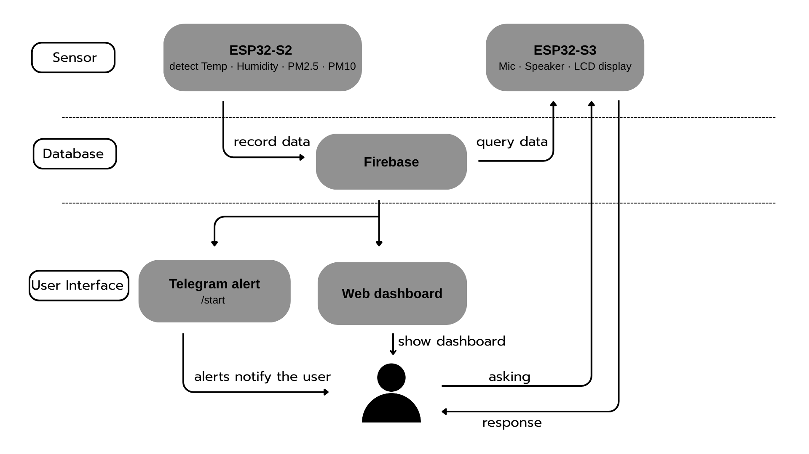

---

## 4. Hardware Implementation

| Type | Model | Purpose |
|--------|-------|---------|
| Microcontroller 1 | ESP32-S2 "Cucumber" | Reads sensors data, publishes via HTTP |
| Microcontroller 2 | ESP8266 | Reads sensors data, publishes via HTTP |
| Microcontroller 3 | LILYGO T-SIMCAM ESP32-S3 (V1.2) | Receives MQTT alert, displays PM2.5 on built-in LCD, accepts voice input, responds via speaker, triggers buzzer/LED |
| Sensor | Honeywell HPM PM2.5 (P/N: 32326466-001) | Measures PM2.5 and PM10 air particles |
| Sensor | Plantower pms7003 | Measures PM2.5 and PM10 air particles |
| Sensor | DHT22 | Measures humidity and temperature |
| Sensor | HTS221 | Measures humidity and temperature |
| Breadboard | Standard full-size solderless | Prototyping connections |

### Device Setup
#### 🏠 Room1 Sensor Station
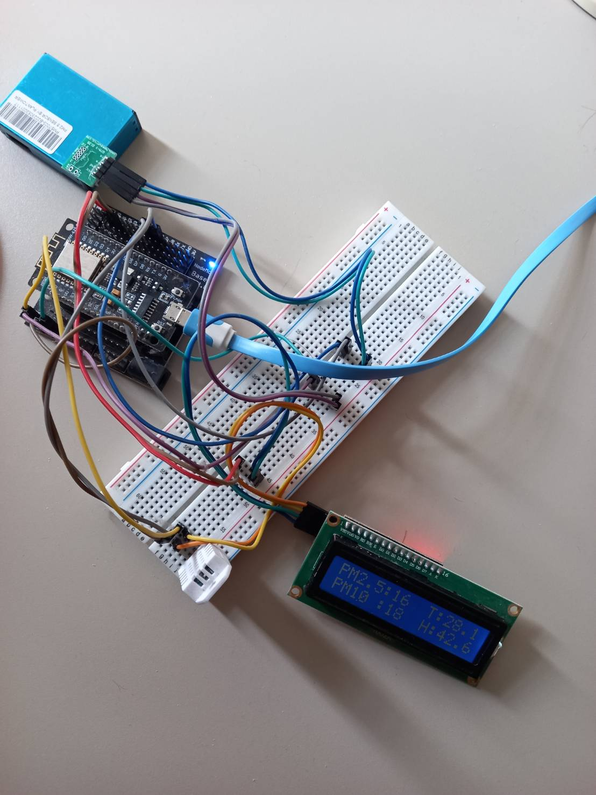

#### 🏠 Room2 Sensor Station
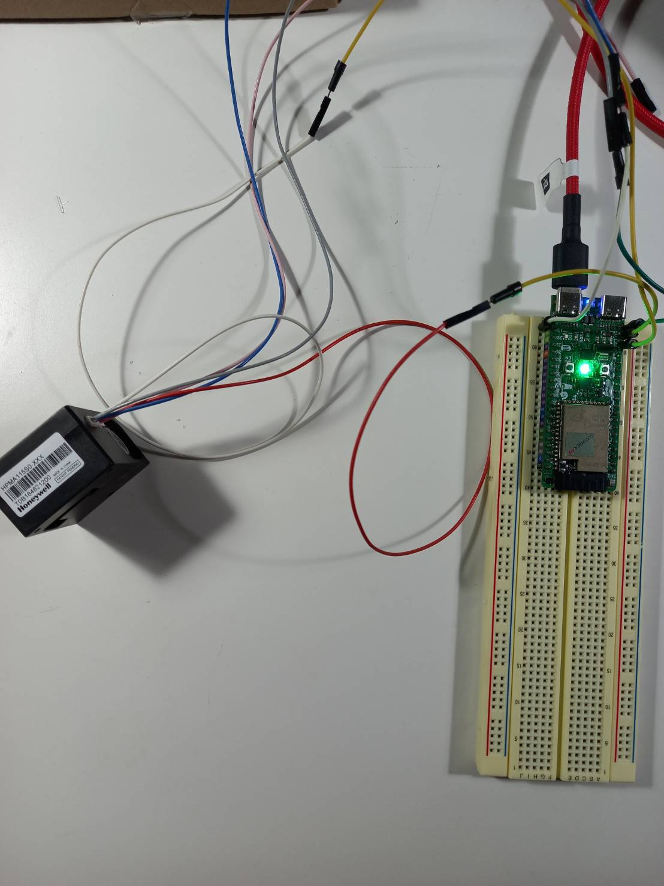

---

## 5. Software Stack

| # | Stack | Technology | Description |
|---|-------|------------|-------------|
| 1 | IoT Sensor Stack (Embedded) | ESP32-S2, ESP8266, ESP32-S3| Reads PM2.5, PM10, Temp, Humidity and pushes to Firebase Realtime DB; ESP32-S3 handles firmware UI and button interrupts |
| 2 | Cloud Database Stack | Firebase Realtime Database, Firebase REST API, Firebase Admin SDK, Docker | Central real-time data store for all sensor readings |
| 3 | AI & Voice Stack | Google Gemini API (text), gTTS, Python, Prompt Engineering | Handle voice interactions, fetch historical data from Firebase, and display real-time information via voice |
| 4 | Chatbot Stack | Python, pyTelegramBotAPI, Firebase Admin SDK, Google Gemini API | Sends alerts to users via Telegram |
| 5 | Dashboard Stack | HTML, JavaScript, Firebase JS SDK | Web dashboard for monitoring and history |

---

## 6. Dataflow Diagram

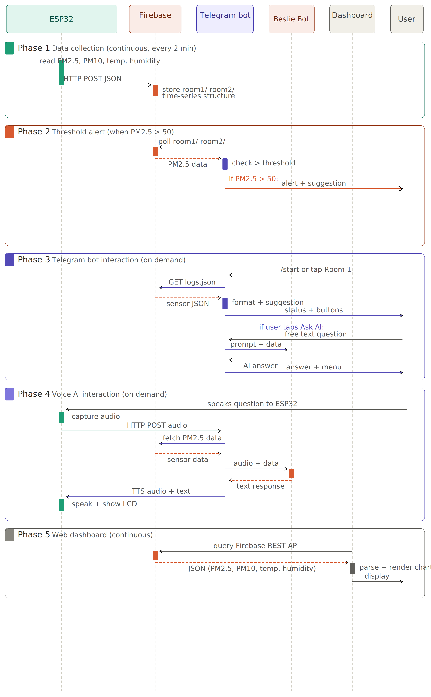


### Phase 1: Data Collection (continuous, every 2 minutes)

```
ESP32-S2/ESP8266 reads PM2.5, PM10, temp, humidity
→ Pushes JSON payload to Firebase via HTTP POST
→ Firebase stores in room1/logs and room2/logs
→ Backend structures time-series data
```

### Phase 2: Threshold Alert (when PM2.5 > 50 µg/m³)

```
Telegram bot polls Firebase every 2 minutes
→ Checks PM2.5 against threshold (50 µg/m³ WHO standard)
→ If exceeded: sends alert to all subscribed Telegram users
→ Firebase sends MQTT alert to ESP32-S3
→ ESP32-S3 displays PM2.5 on LCD, triggers buzzer/LED
```

### Phase 3: Telegram Bot Interaction (on demand)

```
User opens Telegram bot → taps /start
→ Sees main menu: Room 1, Room 2, AQI Guide, Ask AI
→ Taps Room 1 → bot fetches room1/logs.json from Firebase
→ Bot displays PM2.5, PM10, temp, humidity + health suggestion
→ If PM2.5 > 50: shows "Estimated Causes" button
→ If Ask AI: sends question + sensor data to Gemini → returns AI answer
```

### Phase 4: Voice AI Interaction (on demand)

```
User speaks question to ESP32-S3
→ ESP32-S3 captures audio → sends to Python server via HTTP POST
→ Server fetches PM2.5 context from Firebase
→ Server calls Gemini API with audio + sensor data
→ Gemini generates response in user's language
→ Server returns text to ESP32-S3
→ ESP32-S3 displays answer on LCD + speaks via gTTS

```

### Phase 5: Web Dashboard (continuous)

```
HTML/JavaScript dashboard queries Firebase REST API
→ Receives PM2.5, PM10, temp, humidity history
→ Renders real-time gauge and trend charts
→ Auto-refreshes to show latest data

```

---

## 7. Required Keys

To deploy this ecosystem, you must configure a `.env` file in the root directory with the following credentials:

| Key | Source | Purpose |
| :--- | :--- | :--- |
| `FIREBASE_API_KEY` | Firebase Console | Authentication for ESP32 and Python Client |
| `DATABASE_URL` | Firebase Realtime DB | The REST endpoint for data storage |
| `GEMINI_API_KEY` | Google AI Studio | Powers the Vision and Voice AI analysis |
| `TELEGRAM_BOT_TOKEN` | @BotFather | Enables the Alert Bot to send messages |
| `CHAT_ID` | Telegram | The specific group/user ID for emergency alerts |

---

## 8. Demo

### 🚀 Voice Bot

https://github.com/user-attachments/assets/96140be9-46c8-4613-9d42-e508dd060500


### 🚀 Telegram Bot

The Telegram bot provides a simple and interactive way to monitor indoor air quality in real time. It connects directly to Firebase and allows users to:

- Check live air quality for multiple rooms
- View recent historical readings
- Understand AQI levels through a guide
- Get estimated pollution causes
- Ask AI questions based on real sensor data
- Receive automatic alerts when PM2.5 exceeds safe levels

---

### 🟢 1. Start & Main Menu

Users begin by typing `/start`, which displays the main menu with all available features.

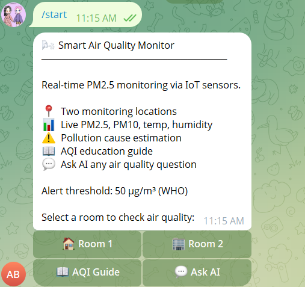

---

### 📘 2. AQI Guide

Provides a clear explanation of PM2.5 levels and health impacts based on WHO guidelines.

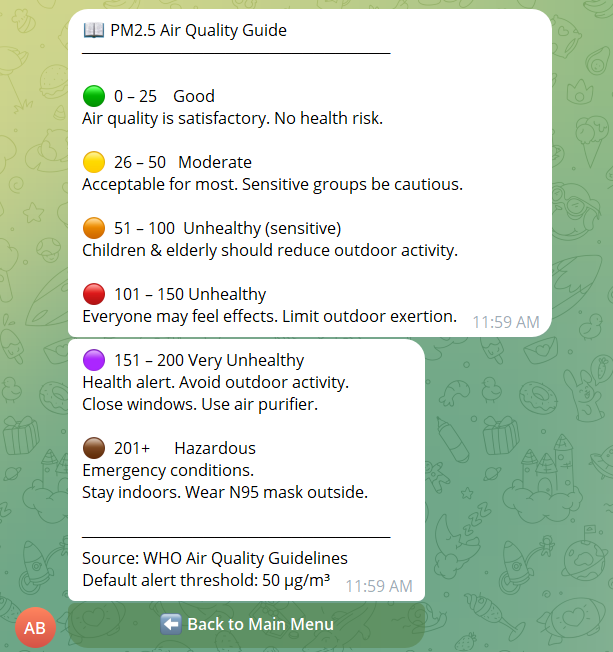

---

### 🏠 3. Room 1 — Live Monitoring

Displays real-time air quality data including PM2.5, PM10, temperature, and humidity, along with a health suggestion.

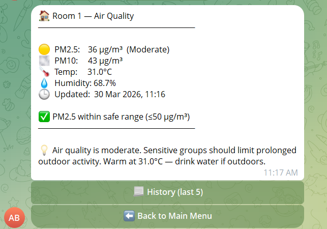

---

### 📊 4. Room 1 — Recent History

Shows the last 5 readings with timestamps and highlights when PM2.5 exceeds the safe threshold.

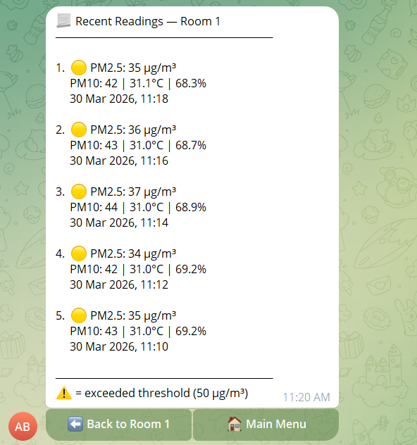

---

### 🏢 5. Room 2 — Live Monitoring

Allows users to check air quality in another location with the same detailed metrics and suggestions.

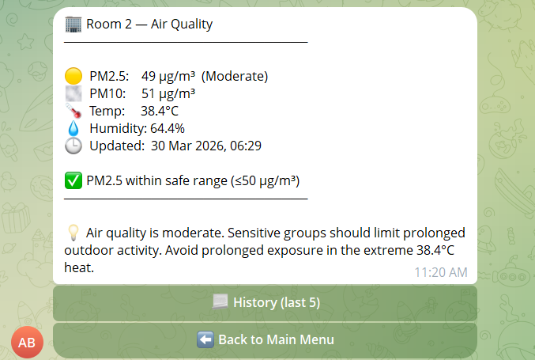

---

### 📊 6. Room 2 — Recent History

Displays historical readings for Room 2 and indicates when pollution levels exceed the threshold.

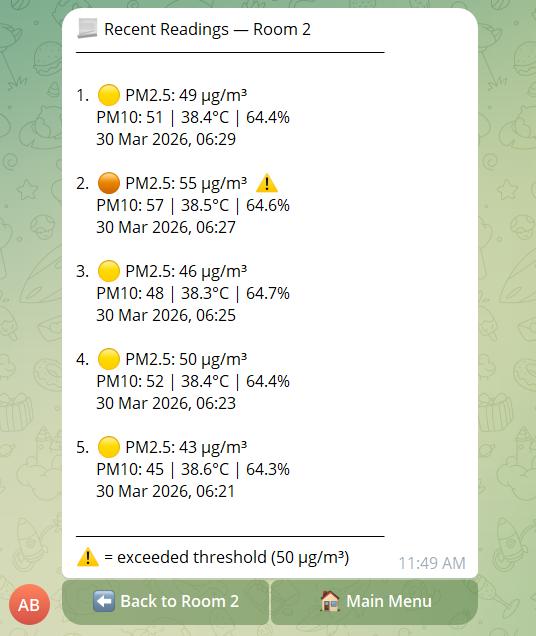

---

### 🤖 7. Ask AI — Smart Assistance

Users can ask natural language questions about air quality. The bot uses live sensor data + AI to generate helpful advice.

Examples:
- Should I wear a mask today?
- Can I open the windows?
- How can I improve indoor air?

<div align="center">
  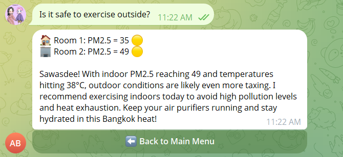
  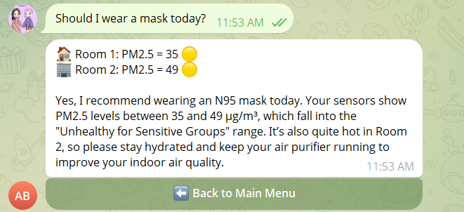
  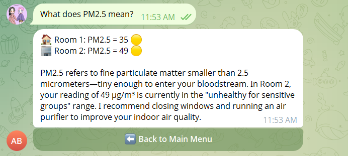
</div>

<br>

<div align="center">
  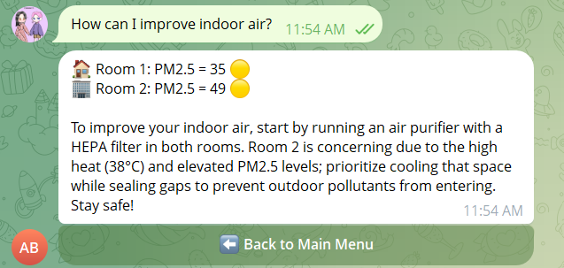
  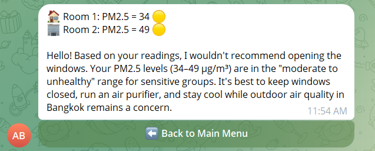
</div>

---

### ⚠️ 8. Automatic Alerts

When PM2.5 exceeds the safe threshold (50 µg/m³), the bot automatically sends alerts with health recommendations so users can take immediate action.

---


### 🚀 Dashboard
https://hanhanjimin.github.io/ICT720-2026-Smart-Air-Quality-Detection/

**Main Website of Smart Air Quality Detection**


**Room 1 page of Smart Air Quality Detection**


**Room 2 page of Smart Air Quality Detection**


---

## 9. Future Work

* **Predictive AI:** Implementing a Long Short-Term Memory (LSTM) model to predict air quality spikes 30 minutes in advance.
* **Localized Feedback:** Using the ESP32-S3's built-in LCD to show QR codes that link directly to health advice based on current PM2.5 levels.
* **Advanced Networking:** Transitioning from the Firebase REST API to **MQTT over WebSockets** to reduce battery consumption on the hardware side.

---

## 10. Role and Tasks

| Name | Role | Primary Tasks |
| :--- | :--- | :--- |
| **Jesdakorn Jaraschotesathien** | Hardware Engineer | Program ESP32-S2/ESP8266 to read PM2.5, PM10, humidity, and temperature; synchronize 4-parameter payloads to **Firebase Realtime Database**. |
| **Nhat Anh Tran** | Voice AI Engineer| Architecture and programming the interactive AI agent combining Google Gemini, gTTS, and Python. Develop the ESP32-S3 firmware (C++) for real-time dynamic UI updates and physical button interrupts. Implement context-aware logic to manage multi-room sensor data from Firebase and design a fault-tolerant audio fallback system. |
| **Thinn Thinn Htet** | Backend Developer | Design the real-time Firebase infrastructure and ESP32 connectivity logic. Structure time-series data and utilize Firebase REST APIs to support the voice-based AI agent, Telegram bot, and web dashboard. |
| **Khin Su Su Han** | Telegram Bot Developer | Developed the Telegram bot for live and historical air-quality monitoring across Station 1 and Station 2. Built interactive bot menus for room status, AQI guide, history checking, and estimated pollution-cause display. Implemented automatic PM2.5 alert notifications with health advice when PM2.5 exceeds the configured threshold. Integrated **Google Gemini** for the **Ask AI** feature to answer air-quality-related questions based on sensor data. |
| **Napat Charoenwong** | Frontend Developer | Build a web-based dashboard using HTML/JavaScript to query Firebase for real-time monitoring and historical trend visualization.|

