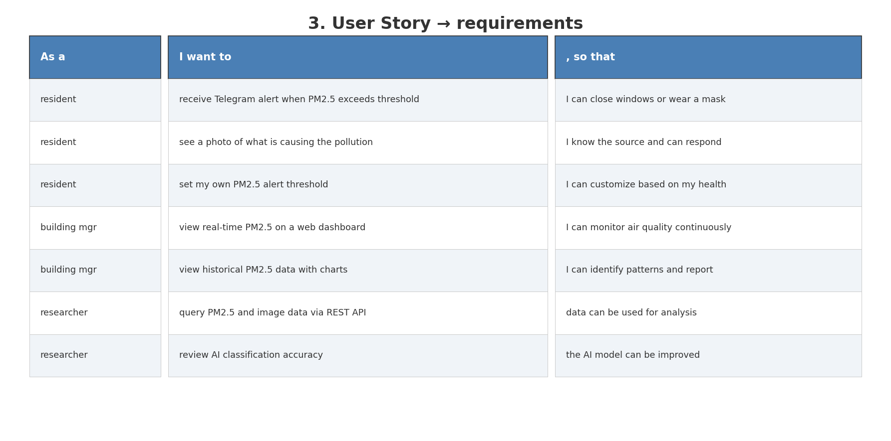
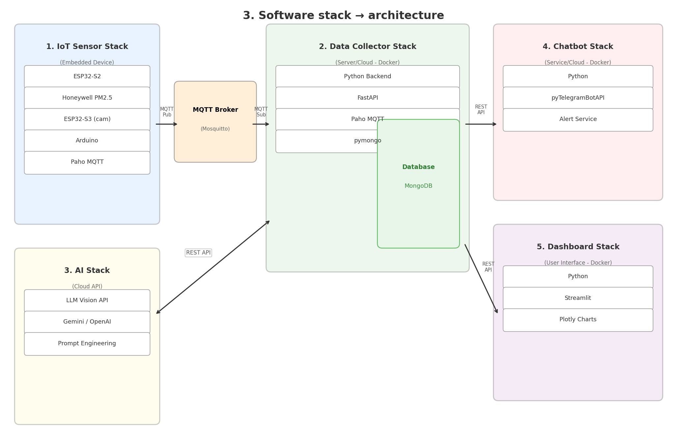
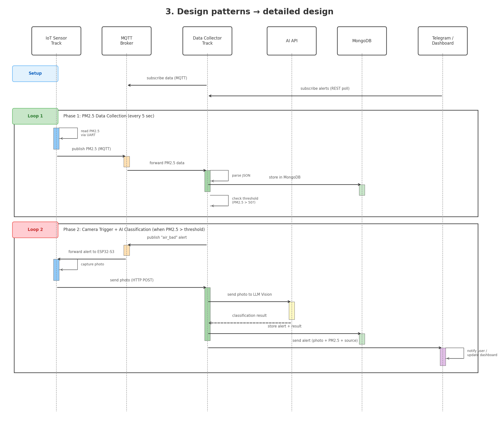

# ICT720-2026-Smart-Air-Quality-Detection
<p>This project designed to help people monitor PM2.5 levels more meaningfully in their own indoor environment. For people who do not own a PM2.5 filter or purifier, it is often difficult to access PM2.5 information directly in their room or workspace. Even for those who already have a PM2.5 filter, most devices only show the current value, without providing any history, trends, or deeper insight. In addition, official air-quality websites usually provide data based on general monitoring stations, so the PM2.5 values may not accurately reflect the actual conditions at your specific location.</p>


## User stories
<p>1. As a room owner, I want to monitor PM2.5 levels in my room remotely through a dashboard, so that I can check air quality even when I am not physically there</p>

<p>2. As a room owner, I want to see historical PM2.5 data , so that I can evaluate whether the room environment is improving or getting worse over time.</p>

<p>3. As a room owner, I want to set safe threshold values for PM2.5, so that the system can notify users when the air quality becomes unhealthy.</p>

<p>4. As a room owner, I want to identify time periods when pollution is highest, so that I can improve ventilation or change room usage habits.</p>
## Software models
## Software stack

- [AIoT stack](#software-stack)
- [Sequence diagram](#sequence-diagram)

## Software interaction

---

## List of Group Members
### Group [GroupName]

#### Members

- **Jesdakorn Jaraschotesathien**: Hardware Engineer — Program the ESP32-S2 and ESP8266 to read PM2.5, PM10, humidity and temperature. Then, send those parameters to online database
- **Nhat Anh Tran**: Voice AI Engineer — Program the LilyGO T-SimCam ESP32-S3 to subscribe to MQTT alerts.
- **Thinn Thinn Htet**: Backend Developer — Build the central Python/FastAPI server in Docker that receives MQTT data, stores readings in MongoDB, checks PM2.5 thresholds, triggers the LilyGO T-SimCam ESP32-S3 alerts, and exposes REST API endpoints for other services.
- **Khin Su Su Han**: Frontend / Bot Developer — Build the Telegram Bot to send air quality alerts.
- **Napat Charoenwong**: Frontend Developer — Build the Streamlit web dashboard for real-time monitoring and historical data visualization.

**Our Goal:** Help residents monitor and understand air quality through a natural voice interface, providing real-time spoken health advice powered by AI.

#### Scope

An IoT-based smart air quality monitoring system that:

- Uses an ESP32-S2 with a Honeywell PM2.5 sensor to continuously monitor air quality in real-time
- Detects when PM2.5 levels exceed a safe threshold (50 µg/m³)
- Triggers an ESP32-S3 camera to capture a photo of the surroundings when air is bad
- Sends the photo to a Google Gemini Vision API to identify the pollution source
- Alerts users via Telegram with the photo, PM2.5 reading, and identified cause
- Stores all readings and alerts in MongoDB for historical analysis
- Displays real-time data and trends on a Streamlit web dashboard

---

## User stories



| As a | I want to | so that |
|------|-----------|---------|
| resident | receive a Telegram alert when PM2.5 exceeds safe levels | I can close windows or wear a mask to protect my health |
| resident | see a photo of what is causing the pollution | I know whether it's smoke, traffic, or construction and can respond |
| resident | set my own PM2.5 alert threshold | I can customize sensitivity based on my health condition |
| building manager | view real-time PM2.5 levels on a web dashboard | I can Announce that residents should wear masks or provide health care advice to residents. |
| building manager | view historical PM2.5 data with charts |  I can prepare the monthly air quality report for the juristic committee and find solutions. |
| researcher | query collected PM2.5 and image data via REST API | I can run statistical analysis and build predictive models for pollution forecasting. |
| researcher | review AI classification accuracy on the dashboard | the AI model can be improved over time |

---

## Software stack



### Stack details

| # | Stack | Technology | Description |
|---|-------|------------|-------------|
| 1 | IoT Sensor Stack (Embedded) | ESP32-S2, ESP32-S3, Honeywell PM2.5, Arduino, Paho MQTT | Reads air quality data and captures photos |
| 2 | Data Collector Stack (Server/Docker) | Python, FastAPI, Paho MQTT, pymongo, MongoDB | Central server that receives, stores, and processes all data |
| 3 | AI Stack (Cloud API) | Google Gemini Vision API, Prompt Engineering | Classifies pollution source from camera photos |
| 4 | Chatbot Stack (Service/Docker) | Python, pyTelegramBotAPI | Sends alerts to users via Telegram |
| 5 | Dashboard Stack (UI/Docker) | Python, Streamlit, Plotly | Web dashboard for monitoring and history |

---

## Sequence diagram



### Phase 1: PM2.5 Data Collection (continuous, every 5 seconds)

```
Server publishes "air_bad" alert via MQTT
→ MQTT forwards to ESP32-S3
→ ESP32-S3 displays current PM2.5 value on screen
→ ESP32-S3 triggers buzzer / LED warning
→ Server sends alert message to Telegram bot
```

### Phase 2: Threshold Alert + Local Display (when PM2.5 > 50 µg/m³)

```
Server publishes "air_bad" alert via MQTT
→ MQTT forwards to ESP32-S3
→ ESP32-S3 displays current PM2.5 value on screen
→ ESP32-S3 triggers buzzer / LED warning
→ Server sends alert message to Telegram bot
```
### Phase 3: Multilingual Voice Query (on-demand by user)

```
User speaks question in any language to ESP32-S3
→ ESP32-S3 captures audio → sends to server via HTTP POST
→ Server calls LLM API (e.g. Gemini) with PM2.5 context + user question
→ LLM generates response in user's language
→ Server returns text response to ESP32-S3
→ ESP32-S3 displays answer on screen (and/or speaks via speaker)
```

### Phase 4: Dashboard Updates

```
Streamlit dashboard
→ queries REST API
→ receives PM2.5 history + alert logs
→ updates charts and displays
```

---

## Hardware

| Device | Model | Purpose |
|--------|-------|---------|
| Microcontroller 1 | ESP32-S2 "Cucumber" | Reads PM2.5 sensor data, publishes via MQTT |
| Microcontroller 2 | LILYGO T-SIMCAM ESP32-S3 (V1.2) | Receives MQTT alert, displays PM2.5 on built-in LCD, accepts voice input, responds via speaker, triggers buzzer/LED |
| Sensor | Honeywell HPM PM2.5 (P/N: 32326466-001) | Measures PM2.5 and PM10 air particles |
| Breadboard | Standard full-size solderless | Prototyping connections |

---

## Project structure

```
ict720-smart-air-quality/
├── README.md
├── images/                          ← Diagrams for this page
│   ├── software_stack.png
│   ├── sequence_diagram.png
│   └── user_stories.png
├── docker-compose.yml               ← One command starts all services
├── mosquitto/
│   └── config/mosquitto.conf
├── firmware/
│   ├── esp32s2_pm25/                ← Member 1
│   │   └── esp32s2_pm25.ino
│   └── esp32s3_camera/              ← Member 2
│       └── esp32s3_camera.ino
├── server/                          ← Member 3 + Member 4
│   ├── Dockerfile
│   ├── main.py
│   ├── ai_classifier.py
│   └── requirements.txt
├── telegram_bot/                    ← Member 5
│   ├── Dockerfile
│   ├── bot.py
│   └── requirements.txt
└── dashboard/                       ← Member 5
    ├── Dockerfile
    ├── app.py
    └── requirements.txt
```

---

## How to run

```bash
# 1. Clone the repo
git clone https://github.com/YOUR_USERNAME/ict720-smart-air-quality.git
cd ict720-smart-air-quality

# 2. Set up environment variables
cp env.example .env
# Edit .env with your Gemini API key and Telegram bot token

# 3. Start all server services
docker-compose up -d

# 4. Flash ESP32-S2 firmware (Member 1)
# Open Arduino IDE → firmware/esp32s2_pm25/esp32s2_pm25.ino → Upload

# 5. Flash ESP32-S3 firmware (Member 2)
# Open Arduino IDE → firmware/esp32s3_camera/esp32s3_camera.ino → Upload

# 6. Access the dashboard
# Open browser → http://localhost:8501
```
